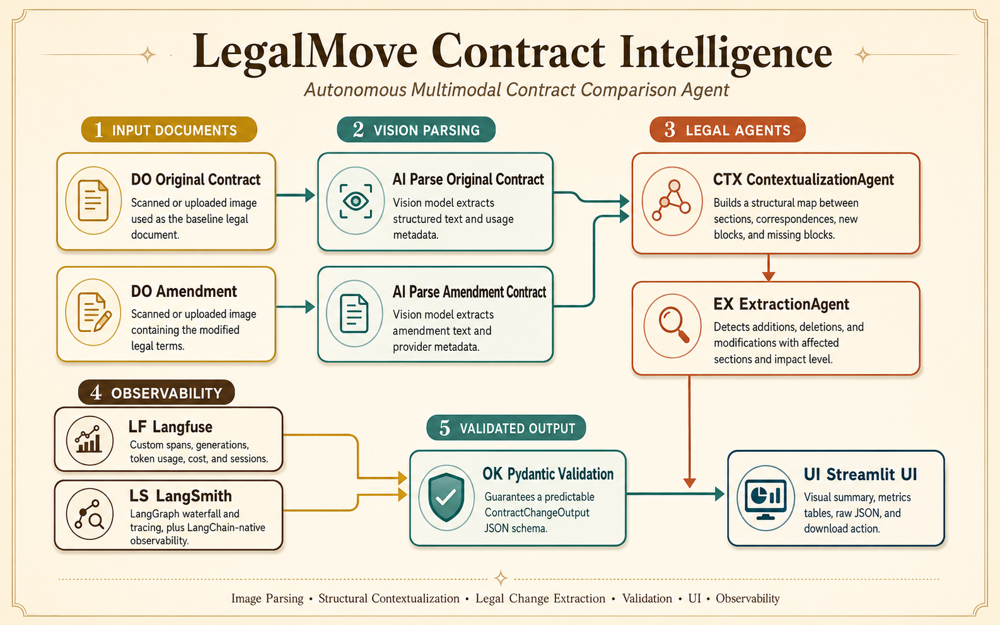
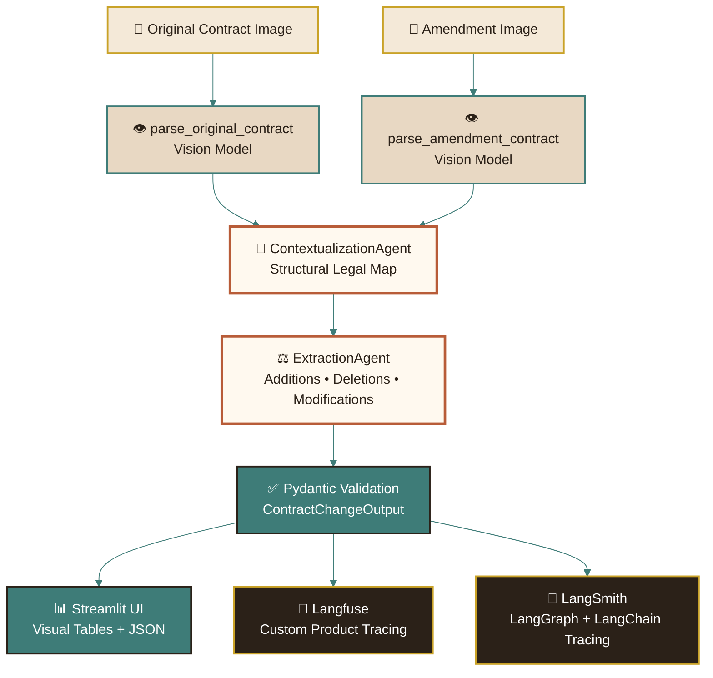
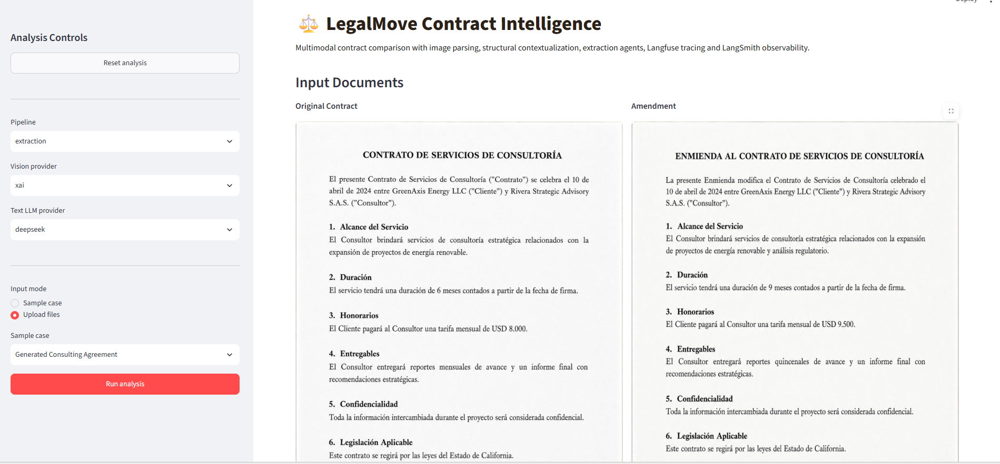
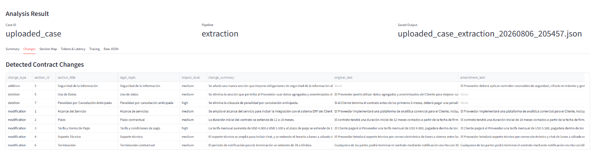
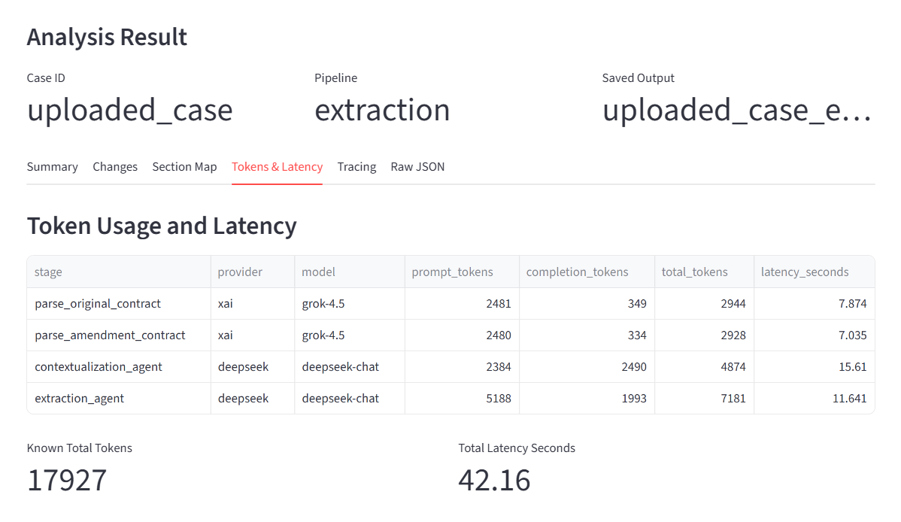
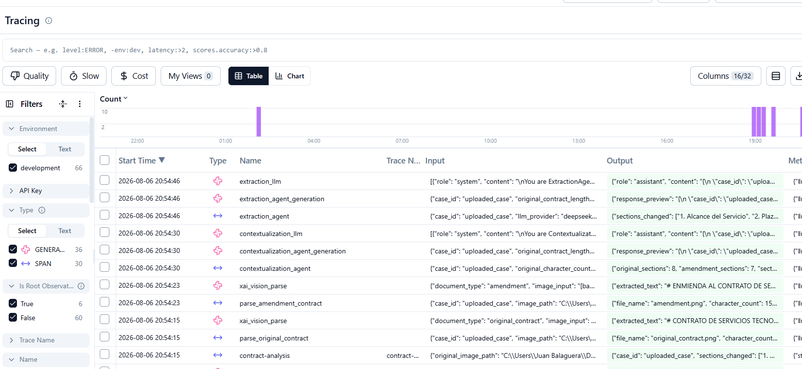
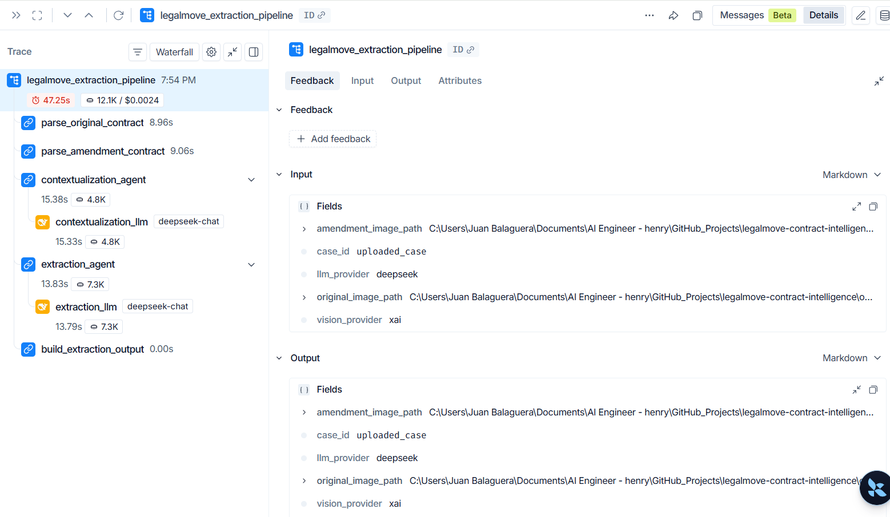

# ⚖️ LegalMove Contract Intelligence

<p align="center">
  <b>Autonomous Multimodal Contract Comparison Agent</b>
</p>

<p align="center">
  <i>Image Parsing • Legal Contextualization • Change Extraction • LangGraph • Langfuse • LangSmith • Streamlit</i>
</p>

<p align="center">
  
</p>

---

## 🧠 Project Overview

**LegalMove Contract Intelligence** is an autonomous contract comparison system designed to analyze an original legal contract and an amendment document from scanned images.

The system uses a multi-step AI workflow to:

```text
1. Parse contract images into structured legal text.
2. Build a contextual structural map between both documents.
3. Extract additions, deletions and modifications.
4. Validate outputs with Pydantic.
5. Trace the full execution with Langfuse and LangSmith.
6. Present results through a Streamlit interface.
```

This project was built as a practical AI Engineering implementation focused on:

```text
- Multimodal AI
- Multi-agent workflows
- Legal document intelligence
- LangGraph orchestration
- Multi-provider LLM architecture
- Observability
- Structured JSON outputs
- Production-style UI
```

---

## 🎯 Main Objective

The main goal of this project is to compare two scanned legal documents:

```text
Original Contract
Amendment / Addendum
```

and produce a validated structured output showing:

```text
- Added clauses
- Deleted clauses
- Modified clauses
- Affected sections
- Legal topics touched
- Summary of the changes
- Confidence score
- Token usage
- Latency
- Provider metadata
```

---

## 🧩 Core Capabilities

```text
✅ Multimodal contract image parsing
✅ Original contract and amendment comparison
✅ Contextual section mapping
✅ Additions detection
✅ Deletions detection
✅ Modifications detection
✅ Pydantic output validation
✅ LangGraph pipeline orchestration
✅ Langfuse tracing
✅ LangSmith tracing
✅ Streamlit UI
✅ Multi-provider support
✅ Token and latency visibility
✅ JSON download support
```

---

## 🏗️ System Architecture

The system is organized as a modular multi-agent workflow.

```text
Image Parser
  ↓
ContextualizationAgent
  ↓
ExtractionAgent
  ↓
Validated JSON Output
  ↓
Streamlit UI + Observability
```

---

## 🕸️ Agent Workflow Diagram

> Recommended screenshot/image to add:
>
> ```text
> assets/diagrams/legalmove_agent_graph.png
> ```

You can create this image by taking a screenshot of the Mermaid diagram below or by rendering it with any Mermaid-compatible editor.



---

## 🧠 Agent Responsibilities

### 👁️ Image Parser

The image parser receives scanned or generated contract images and extracts the text using a vision-capable provider.

Supported vision providers:

```text
openai
xai
```

Main responsibilities:

```text
- Validate image path
- Validate image extension
- Convert image to base64
- Build image data URL
- Send image to vision model
- Extract readable contract text
- Return token usage, model metadata and latency
```

---

### 🧠 ContextualizationAgent

The `ContextualizationAgent` receives:

```text
- Original contract text
- Amendment text
```

and produces a structural legal map.

It identifies:

```text
- Sections in the original contract
- Sections in the amendment
- Section correspondences
- New blocks in the amendment
- Potentially missing blocks
- Structural summary
- Confidence score
```

This agent does **not** extract final legal changes.  
Its responsibility is to understand how both documents are organized.

---

### ⚖️ ExtractionAgent

The `ExtractionAgent` receives:

```text
- Original contract text
- Amendment text
- ContextualizationAgent output
```

and produces the final legal change extraction.

It identifies:

```text
- additions
- deletions
- modifications
- sections_changed
- topics_touched
- unclear_items
- summary_of_the_change
- confidence_score
```

This is the final structured output used by the UI and saved JSON files.

---

## 🛠️ Technology Stack

```text
Python
LangGraph
LangChain
OpenAI
xAI / Grok
DeepSeek
Pydantic
Streamlit
Langfuse
LangSmith
uv
pandas
python-dotenv
```

---

## 🧬 Multi-Provider Design

The project supports multiple providers through factory modules.

### Vision Providers

```text
OpenAI Vision
xAI / Grok Vision
```

### Text LLM Providers

```text
OpenAI
xAI / Grok
DeepSeek
```

This allows the pipeline to run with different combinations, for example:

```text
Vision: openai
Text LLM: openai
```

```text
Vision: xai
Text LLM: deepseek
```

---

## 📂 Project Structure

```text
legalmove-contract-intelligence/
├── app/
│   └── streamlit_app.py
│
├── assets/
│   ├── diagrams/
│   │   └── legalmove_agent_graph.png
│   └── screenshots/
│       ├── 01_streamlit_home.png
│       ├── 02_input_documents.png
│       ├── 03_summary_tab.png
│       ├── 04_changes_table.png
│       ├── 05_section_map.png
│       ├── 06_tokens_latency.png
│       ├── 07_tracing_tab.png
│       ├── 08_raw_json.png
│       ├── 09_langfuse_trace.png
│       └── 10_langsmith_run.png
│
├── data/
│   └── test_contracts/
│       ├── simple_case/
│       ├── complex_case/
│       └── generate_case/
│
├── outputs/
│   ├── examples/
│   ├── runtime_uploads/
│   └── streamlit/
│
├── src/
│   ├── agents/
│   │   ├── contextualization_agent.py
│   │   └── extraction_agent.py
│   │
│   ├── config/
│   │   └── settings.py
│   │
│   ├── graph/
│   │   ├── graph_builder.py
│   │   ├── nodes.py
│   │   └── state.py
│   │
│   ├── observability/
│   │   └── tracing.py
│   │
│   ├── providers/
│   │   ├── llm_factory.py
│   │   └── vision_factory.py
│   │
│   ├── image_parser.py
│   ├── main.py
│   └── models.py
│
├── .env.example
├── .gitignore
├── pyproject.toml
├── requirements.txt
├── uv.lock
└── README.md
```

---

## 🖼️ Recommended Screenshots to Add

Add the following screenshots under:

```text
assets/screenshots/
```

### 1. Streamlit Home

```text
assets/screenshots/01_streamlit_home.png
```

Recommended content:

```text
- LegalMove title
- Sidebar controls
- Sample case selector
- Pipeline selector
```

---

### 2. Input Documents

```text
assets/screenshots/02_input_documents.png
```

Recommended content:

```text
- Original contract image preview
- Amendment image preview
```

---

### 3. Summary Tab

```text
assets/screenshots/03_summary_tab.png
```

Recommended content:

```text
- Additions count
- Deletions count
- Modifications count
- Confidence score
- Summary of the change
```

---

### 4. Changes Table

```text
assets/screenshots/04_changes_table.png
```

Recommended content:

```text
- change_type
- section_id
- section_title
- legal_topic
- impact_level
- change_summary
```

---

### 5. Section Map

```text
assets/screenshots/05_section_map.png
```

Recommended content:

```text
- original_section_id
- amendment_section_id
- relationship_type
- rationale
```

---

### 6. Tokens and Latency

```text
assets/screenshots/06_tokens_latency.png
```

Recommended content:

```text
- stage
- provider
- model
- prompt_tokens
- completion_tokens
- total_tokens
- latency_seconds
```

---

### 7. Tracing Tab

```text
assets/screenshots/07_tracing_tab.png
```

Recommended content:

```text
- Langfuse vs LangSmith comparison table
- Observability status JSON
```

---

### 8. Raw JSON

```text
assets/screenshots/08_raw_json.png
```

Recommended content:

```text
- Full structured JSON output
- Download JSON button
```

---

### 9. Langfuse Trace

```text
assets/screenshots/09_langfuse_trace.png
```

Recommended content:

```text
- contract-analysis trace
- parse_original_contract span
- parse_amendment_contract span
- contextualization_agent span
- extraction_agent span
- token and latency metadata
```

---

### 10. LangSmith Run

```text
assets/screenshots/10_langsmith_run.png
```

Recommended content:

```text
- legalmove_extraction_pipeline
- LangGraph waterfall
- contextualization_llm
- extraction_llm
```

---

## 🖼️ Screenshot Gallery

<p align="center">
  
</p>

<p align="center">
  
</p>

<p align="center">
  
</p>

<p align="center">
  
</p>

<p align="center">
  
</p>

---

## ⚙️ Installation

### 1. Clone the repository

```bash
git clone https://github.com/juanmabaal/legalmove-contract-intelligence.git
cd legalmove-contract-intelligence
```

---

### 2. Install uv

If `uv` is not installed:

```bash
pip install uv
```

---

### 3. Create and sync the environment

```bash
uv sync
```

If needed, install from `requirements.txt`:

```bash
uv pip install -r requirements.txt
```

---

### 4. Validate the environment

```bash
uv run python --version
```

```bash
uv run python -c "from src.graph.graph_builder import build_extraction_graph; print('Graph OK')"
```

---

## 🔐 Environment Variables

Create a `.env` file in the project root.

You can start from:

```bash
cp .env.example .env
```

On Windows PowerShell:

```powershell
Copy-Item .env.example .env
```

---

## 🔑 API Keys Configuration

### OpenAI

Required when using:

```text
VISION_PROVIDER=openai
LLM_PROVIDER=openai
```

```env
OPENAI_API_KEY=your_openai_api_key
OPENAI_VISION_MODEL=gpt-4o
OPENAI_TEXT_MODEL=gpt-4o-mini
```

---

### xAI / Grok

Required when using:

```text
VISION_PROVIDER=xai
LLM_PROVIDER=xai
```

```env
XAI_API_KEY=your_xai_api_key
XAI_VISION_MODEL=grok-4.5
XAI_TEXT_MODEL=grok-4.5
XAI_BASE_URL=https://api.x.ai/v1
```

---

### DeepSeek

Required when using:

```text
LLM_PROVIDER=deepseek
```

```env
DEEPSEEK_API_KEY=your_deepseek_api_key
DEEPSEEK_TEXT_MODEL=deepseek-chat
```

---

### Langfuse

Used for custom product observability.

```env
LANGFUSE_PUBLIC_KEY=your_langfuse_public_key
LANGFUSE_SECRET_KEY=your_langfuse_secret_key
LANGFUSE_HOST=https://cloud.langfuse.com
LANGFUSE_BASE_URL=https://cloud.langfuse.com
```

---

### LangSmith

Used for native LangChain and LangGraph tracing.

```env
LANGSMITH_TRACING=true
LANGSMITH_API_KEY=your_langsmith_api_key
LANGSMITH_PROJECT=legalmove-contract-intelligence

LANGCHAIN_TRACING_V2=true
LANGCHAIN_API_KEY=your_langsmith_api_key
LANGCHAIN_PROJECT=legalmove-contract-intelligence
LANGCHAIN_ENDPOINT=https://api.smith.langchain.com
LANGCHAIN_CALLBACKS_BACKGROUND=false
```

---

### App Configuration

```env
APP_ENV=development
OUTPUT_DIR=outputs
VISION_PROVIDER=openai
LLM_PROVIDER=openai
LLM_FALLBACK_PROVIDER=openai
```

---

## 🧪 Running the CLI Pipelines

The project supports three pipeline modes:

```text
image-parsing
contextualization
extraction
```

---

## 👁️ Image Parsing Pipeline

This pipeline only extracts text from the original contract image and amendment image.

```bash
uv run python -m src.main --original data/test_contracts/generate_case/original_contract.png --amendment data/test_contracts/generate_case/amendment.png --case-id generate_case --vision-provider openai --pipeline image-parsing --save-output
```

Expected output:

```text
outputs/examples/generate_case_image-parsing_output.json
```

---

## 🧠 Contextualization Pipeline

This pipeline extracts text and builds a structural map between both documents.

```bash
uv run python -m src.main --original data/test_contracts/generate_case/original_contract.png --amendment data/test_contracts/generate_case/amendment.png --case-id generate_case --vision-provider openai --llm-provider openai --pipeline contextualization --save-output
```

Expected output:

```text
outputs/examples/generate_case_contextualization_output.json
```

---

## ⚖️ Extraction Pipeline

This pipeline runs the full workflow:

```text
image parsing → contextualization → extraction
```

```bash
uv run python -m src.main --original data/test_contracts/generate_case/original_contract.png --amendment data/test_contracts/generate_case/amendment.png --case-id generate_case --vision-provider openai --llm-provider openai --pipeline extraction --save-output
```

Expected output:

```text
outputs/examples/generate_case_extraction_output.json
```

---

## 🧪 Multi-Provider Example

Example using:

```text
Vision provider: xai
Text LLM provider: deepseek
```

```bash
uv run python -m src.main --original data/test_contracts/generate_case/original_contract.png --amendment data/test_contracts/generate_case/amendment.png --case-id generate_case_xai_deepseek --vision-provider xai --llm-provider deepseek --pipeline extraction --save-output
```

Expected output:

```text
outputs/examples/generate_case_xai_deepseek_extraction_output.json
```

---

## 🖥️ Running the Streamlit UI

Start the Streamlit interface:

```bash
uv run streamlit run app/streamlit_app.py
```

The app should open at:

```text
http://localhost:8501
```

---

## 🧭 Streamlit UI Features

The UI supports:

```text
✅ Sample case selection
✅ Image upload mode
✅ Pipeline selection
✅ Vision provider selection
✅ Text LLM provider selection
✅ Visual summary
✅ Changes table
✅ Section correspondence table
✅ Token usage table
✅ Latency table
✅ Lightweight Langfuse vs LangSmith comparison
✅ Raw JSON viewer
✅ JSON download
✅ Reset button
```

---

## 🧪 Recommended UI Test

Use this setup in the sidebar:

```text
Pipeline: extraction
Vision provider: xai
Text LLM provider: deepseek
Input mode: Upload files
Case ID: uploaded_case
```

Upload:

```text
original_contract.png
amendment.png
```

Expected result:

```text
Additions:
- Seguridad de la Información

Deletions:
- Uso de Datos
- Penalidad por Cancelación Anticipada

Modifications:
- Alcance del Servicio
- Plazo
- Tarifa y Forma de Pago
- Soporte Técnico
- Terminación
```

---

## 📊 Streamlit Output Tabs

### Summary

Shows:

```text
- Additions count
- Deletions count
- Modifications count
- Confidence score
- Executive summary
```

---

### Changes

Shows a visual table with:

```text
- change_type
- section_id
- section_title
- legal_topic
- impact_level
- change_summary
- original_text
- amendment_text
```

---

### Section Map

Shows contextual correspondences:

```text
- original_section_id
- amendment_section_id
- relationship_type
- rationale
```

---

### Tokens & Latency

Shows model metadata and usage:

```text
- stage
- provider
- model
- prompt_tokens
- completion_tokens
- total_tokens
- latency_seconds
```

---

### Tracing

Shows a lightweight comparison between:

```text
Langfuse
LangSmith
```

The detailed traces remain available inside each external platform.

---

### Raw JSON

Shows:

```text
- Full structured output
- JSON download button
```

---

## 🔭 Observability

This project includes two observability layers.

---

## 🔭 Langfuse

Langfuse is used for custom product-level tracing.

Expected trace name:

```text
contract-analysis
```

Expected structure:

```text
contract-analysis
├── parse_original_contract
│   └── openai_vision_parse / xai_vision_parse
├── parse_amendment_contract
│   └── openai_vision_parse / xai_vision_parse
├── contextualization_agent
│   └── contextualization_agent_generation
│       └── contextualization_llm
└── extraction_agent
    └── extraction_agent_generation
        └── extraction_llm
```

Langfuse captures:

```text
- case_id
- pipeline
- provider metadata
- model metadata
- tokens
- latency
- confidence scores
- session_id
- status
```

---

## 🧬 LangSmith

LangSmith is used for native LangChain and LangGraph tracing.

Expected run name:

```text
legalmove_extraction_pipeline
```

Expected run structure:

```text
legalmove_extraction_pipeline
├── parse_original_contract
├── parse_amendment_contract
├── contextualization_agent
│   └── contextualization_llm
├── extraction_agent
│   └── extraction_llm
└── build_extraction_output
```

LangSmith captures:

```text
- graph execution waterfall
- runnable metadata
- tags
- LLM calls
- latency
- pipeline metadata
```

---

## 🆚 Langfuse vs LangSmith

| Tool | Main Role | Best For |
|---|---|---|
| Langfuse | Custom product observability | Product traces, spans, generations, cost, tokens and session metadata |
| LangSmith | LangChain/LangGraph observability | Runnable traces, graph waterfall, LangChain metadata and LLM calls |

---

## 📦 Output Structure

The final extraction output includes:

```json
{
  "case_id": "generate_case",
  "original_contract": {},
  "amendment": {},
  "contextualization": {},
  "extraction": {}
}
```

---

## ✅ Final Extraction Schema

The final extraction result includes:

```text
sections_changed
topics_touched
additions
deletions
modifications
unclear_items
summary_of_the_change
confidence_score
latency_seconds
llm_provider
llm_model
usage
```

---

## 🧪 Test Cases

### Simple Case

```text
data/test_contracts/simple_case/
```

Focus:

```text
- Software license contract
- Contract duration change
- Fee change
- Support change
- New data protection clause
```

---

### Complex Case

```text
data/test_contracts/complex_case/
```

Focus:

```text
- Consulting services agreement
- Service scope change
- Duration change
- Fee change
- Deliverables change
- New intellectual property clause
```

---

### Generate Case

```text
data/test_contracts/generate_case/
```

Focus:

```text
- Generated consulting agreement
- Regulatory analysis addition
- Duration extension
- Fee increase
- Deliverable frequency change
- New intellectual property clause
```

---

### Uploaded Case

Used to validate:

```text
- additions
- deletions
- modifications
```

Expected result:

```text
Additions:
- Seguridad de la Información

Deletions:
- Uso de Datos
- Penalidad por Cancelación Anticipada

Modifications:
- Alcance del Servicio
- Plazo
- Tarifa y Forma de Pago
- Soporte Técnico
- Terminación
```

---

## 🧾 Example Final Result

```text
The amendment modifies the technology services agreement by expanding the scope to include ERP integration, extending the term from 12 to 18 months, increasing the monthly fee from USD 4,000 to USD 5,500, extending the payment deadline, expanding support coverage, increasing the termination notice period, adding an information security clause, and removing the data usage and early cancellation penalty clauses.
```

---

## 🧪 Validation Commands

Validate imports:

```bash
uv run python -c "from src.graph.graph_builder import build_extraction_graph; print('Graph OK')"
```

Validate agents:

```bash
uv run python -c "from src.agents.contextualization_agent import run_contextualization_agent; from src.agents.extraction_agent import run_extraction_agent; print('Agents OK')"
```

Validate Streamlit helpers:

```bash
uv run python -c "from app.streamlit_app import build_usage_table, build_changes_table; print('Streamlit UI imports OK')"
```

Validate observability status:

```bash
uv run python -c "from src.observability.tracing import get_observability_status; print(get_observability_status())"
```

---

## 🧹 Cleaning Local Runtime Files

```powershell
Get-ChildItem -Recurse -Directory -Filter "__pycache__" | Remove-Item -Recurse -Force
Get-ChildItem -Recurse -File -Filter "*.pyc" | Remove-Item -Force
```

---

## 🚫 Files Ignored by Git

The following files should not be committed:

```text
.env
.streamlit/secrets.toml
outputs/runtime_uploads/
outputs/streamlit/
__pycache__/
*.pyc
```

---

## 🌿 Suggested Git Workflow

Create final documentation branch:

```bash
git checkout main
git pull origin main
git checkout -b feature/final-documentation
```

Add README changes:

```bash
git add README.md
git add assets/diagrams
git add assets/screenshots
```

Commit:

```bash
git commit -m "docs: add final project README" -m "Add complete documentation for LegalMove Contract Intelligence.

This README includes:
- Project overview
- Architecture
- Agent workflow
- Installation steps
- API key configuration
- CLI commands
- Streamlit instructions
- Observability documentation
- Test cases
- Validation commands
- Screenshot placeholders
- Final project context."
```

Push:

```bash
git push -u origin feature/final-documentation
```

---

## 🧠 Key Design Decisions

### 1. LangGraph for orchestration

LangGraph coordinates the workflow as a stateful graph.

This makes the pipeline easier to extend with additional agents, validation nodes or reporting nodes.

---

### 2. Separate agents by responsibility

The project separates:

```text
ContextualizationAgent → understands structure
ExtractionAgent → extracts final legal changes
```

This improves reliability and makes the system easier to debug.

---

### 3. Pydantic validation

Pydantic is used to ensure that outputs follow a predictable schema.

This helps prevent invalid or inconsistent LLM responses from breaking the system.

---

### 4. Multi-provider architecture

The system uses provider factories so different LLM providers can be tested without rewriting the pipeline.

---

### 5. Observability-first approach

Langfuse and LangSmith are both included to make the system easier to inspect, debug and explain.

---

### 6. Streamlit for demonstration

Streamlit provides an accessible interface for uploading documents, running the pipeline and visualizing results.

---

## ⚠️ Limitations

```text
- The system does not provide legal advice.
- OCR quality depends on image quality.
- Provider outputs may vary between runs.
- Token metadata may differ across providers.
- Langfuse and LangSmith require external credentials.
- The system currently compares one original document with one amendment at a time.
```

---

## 🚀 Future Improvements

```text
- PDF report generation
- Batch comparison
- Multi-page document support
- Clause-level risk scoring
- Human review workflow
- Export to DOCX/PDF
- Advanced legal risk matrix
- Direct Langfuse/LangSmith trace links inside Streamlit
- Provider fallback strategy
- Automated test suite
```

---

## 🛡️ Disclaimer

This project is intended for educational, demonstration and AI engineering purposes.

It does not provide legal advice and should not be used as a substitute for professional legal review.

---

## 👤 Author

```text
Juan Manuel Balaguera Alvira
AI Engineer Project
LegalMove Contract Intelligence
```

---

## ✅ Project Status

```text
Day 1: Image Parsing ✅
Day 2: ContextualizationAgent ✅
Day 3: ExtractionAgent ✅
Day 4: Langfuse + LangSmith Tracing ✅
Day 5: Streamlit UI ✅
Final README Documentation ✅
```